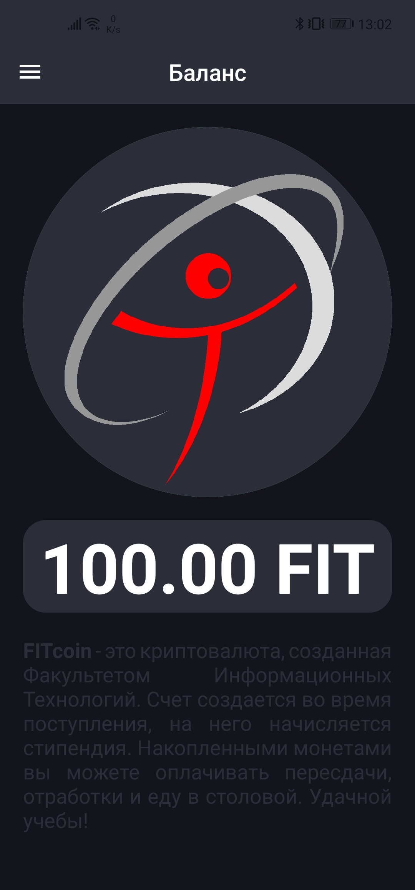
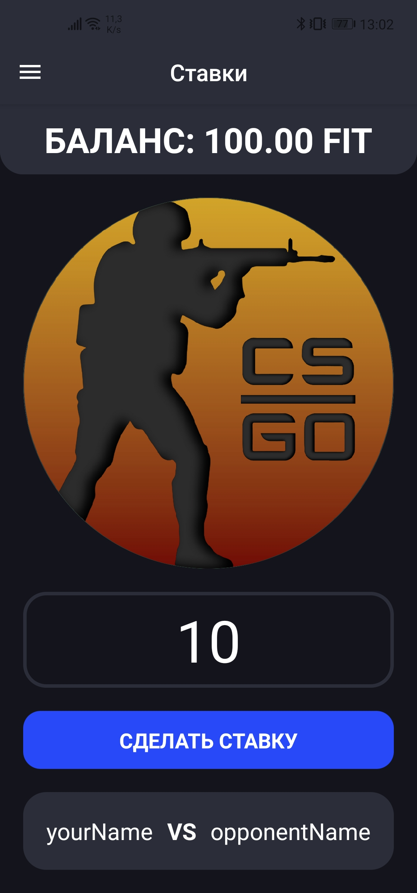

# FITcoin React Native

### [APK is here!](/apk)

My first experience in developing an application on the React Native platform.

The application has limited functionality due to the insufficient amount of time after which the application had to be ready, and my limited experience in RN).

*Below you can see some screenshots*

|  |  |  |
| ------------------------------------ | ------------------------------------ | ------------------------------------ |

The purpose of the app is to use it when shooting a short film to represent a group of freshmen at the **FIT Freshman Day** event at the university.

The application allows you to specify the current balance, as well as its change and play the animation of receiving / sending "money" with a specified delay. It is also possible to place a bet while playing a computer game.
